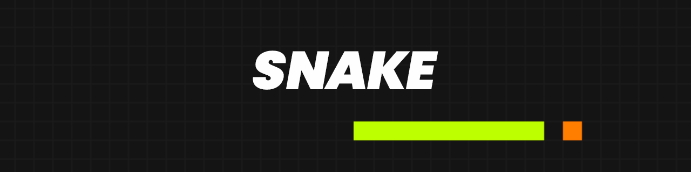

<h1>

</h1>
 

 

<h3>
    Clássico jogo Snake desenvolvido com Html, CSS e JavaScript, utilizando LocalStorage para salvar o maior recorde do jogador, na memória do navegador.
</h3>
 
<a href="https://guipaex.github.io/Snake-Game/" alt="Ver site">Ver Demo</a>
·
<a href="https://github.com/guipaex/Snake-Game/issues" alt="Reportar Bug">Reportar Bug</a>
·
<a href="https://github.com/guipaex/Snake-Game/issues" alt="Faça uma sugestão">Sugestões</a>

 

## Tecnologias Utilizadas
  
  
  
  

 

<h3 width="100%" style="display:flex; justify-content:center">Feito compor Guilherme Paes.</h3>
